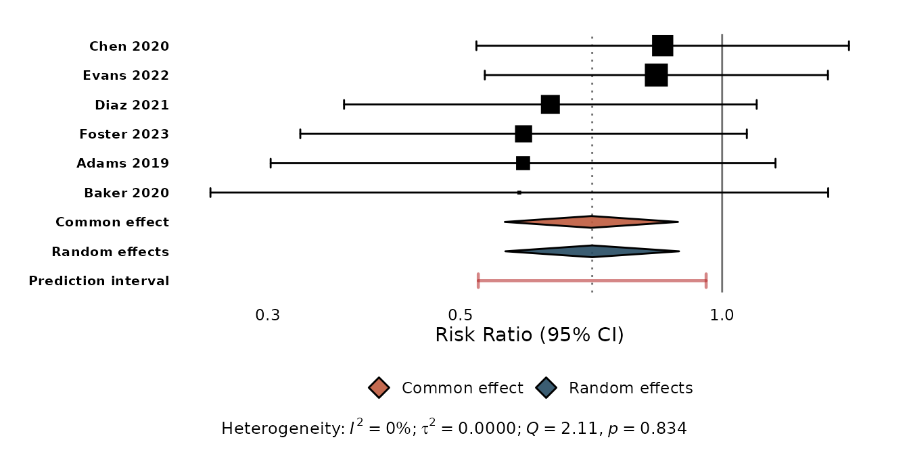
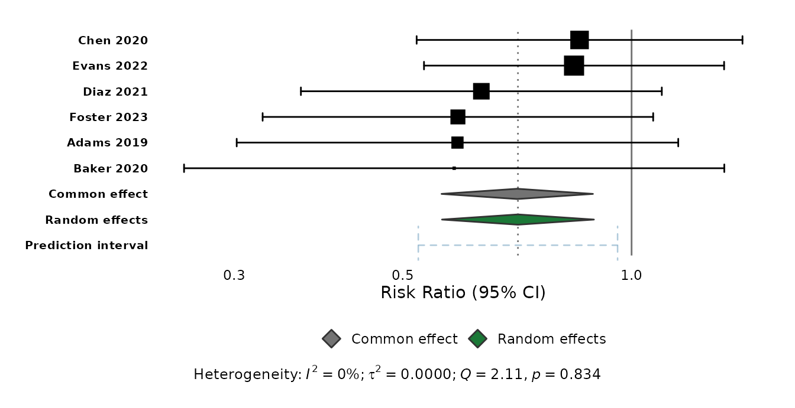
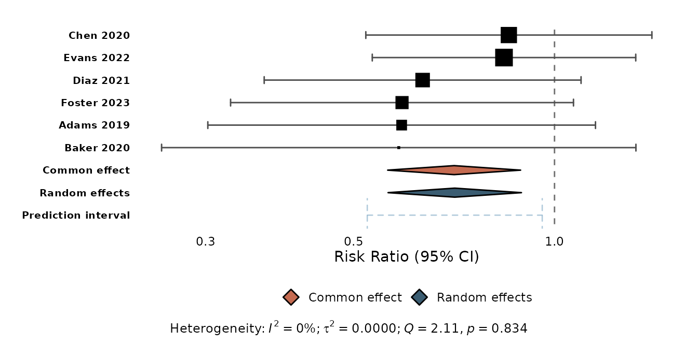
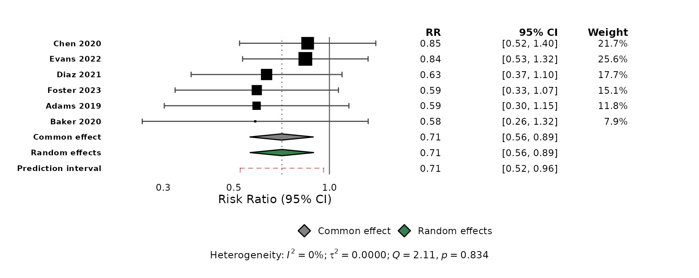
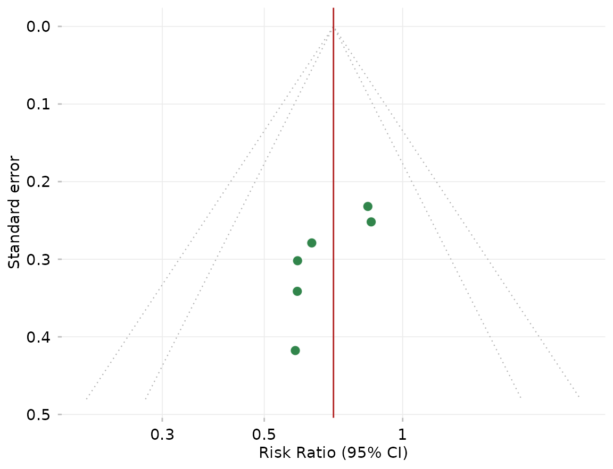

# Customising forest and funnel plots

[`ggforest()`](https://drhrf.github.io/ggmeta/reference/ggforest.md) and
[`ggfunnel()`](https://drhrf.github.io/ggmeta/reference/ggfunnel.md)
assemble several layers for you — study confidence intervals, summary
diamonds, a prediction interval, reference lines, funnel points and
contours. You restyle any of them with a matching `*_args` argument: a
named list of arguments passed straight to the underlying geom.

This is the intended way to change those elements. Adding another
`geom_forest_*()` layer to a
[`ggforest()`](https://drhrf.github.io/ggmeta/reference/ggforest.md)
plot does **not** restyle the built-in one — it draws a *second* layer
over every row.

``` r

library(ggmeta)
library(ggplot2)
```

``` r

library(meta)
#> Loading required package: metabook
#> Loading 'meta' package (version 8.5-0).
#> Type 'help(meta)' for a brief overview.

dat <- data.frame(
  study   = c("Adams 2019", "Baker 2020", "Chen 2020",
              "Diaz 2021", "Evans 2022", "Foster 2023"),
  event.e = c(12,  8, 25, 18, 30, 15), n.e = c(120,  90, 200, 150, 250, 130),
  event.c = c(20, 14, 30, 28, 35, 25), n.c = c(118,  92, 205, 148, 245, 128)
)
m <- metabin(event.e, n.e, event.c, n.c,
             data = dat, studlab = study, sm = "RR")
```

## The prediction interval

`predict_args` controls the prediction interval — `colour`, `linetype`,
`linewidth`, `alpha`, and the end-cap size `cap_width`:

``` r

ggforest(m, predict_args = list(
  cap_width = 0.1, colour = "firebrick", linewidth = 0.8, linetype = "solid"
))
```



## Summary diamonds

Recolour the diamonds with `diamond_colours` — a named vector keyed by
`"common"`, `"random"`, `"subgroup_common"`, `"subgroup_random"` — and
restyle their border or transparency with `diamond_args`:

``` r

ggforest(m,
  diamond_colours = c(common = "grey45", random = "#1B7837"),
  diamond_args    = list(colour = "grey20", alpha = 1)
)
```



## Study intervals and reference lines

`ci_args` styles the study confidence intervals and their
weight-proportional squares (including `point_size_range`). `ref_args`
styles the null-effect line, and `consensus` / `consensus_args` control
the dotted pooled-estimate line:

``` r

ggforest(m,
  ci_args   = list(colour = "grey30", point_size_range = c(1, 5)),
  ref_args  = list(linetype = "dashed"),
  consensus = FALSE
)
```



## Everything together

The styling arguments combine freely, and work with the
[`meta::forest()`](https://wviechtb.github.io/metafor/reference/forest.html)-style
table columns too:

``` r

ggforest(m, columns = TRUE,
  predict_args    = list(cap_width = 0.1, colour = "firebrick"),
  diamond_colours = c(common = "grey45", random = "#1B7837"),
  ci_args         = list(colour = "grey30")
)
```



## Funnel plots

[`ggfunnel()`](https://drhrf.github.io/ggmeta/reference/ggfunnel.md)
follows the same pattern with `point_args` (the study points),
`contour_args` (the pseudo confidence-interval contours), and `ref_args`
(the vertical reference line):

``` r

ggfunnel(m,
  point_args   = list(size = 3, fill = "#1B7837"),
  contour_args = list(colour = "grey70", linetype = "dotted", level = c(0.95, 0.99)),
  ref_args     = list(colour = "firebrick")
)
```



## See also

- [`vignette("getting-started")`](https://drhrf.github.io/ggmeta/articles/getting-started.md)
  — a tour of the package.
- [`vignette("from-meta-forest")`](https://drhrf.github.io/ggmeta/articles/from-meta-forest.md)
  — coming from
  [`meta::forest()`](https://wviechtb.github.io/metafor/reference/forest.html).
- [`?ggforest`](https://drhrf.github.io/ggmeta/reference/ggforest.md)
  and
  [`?ggfunnel`](https://drhrf.github.io/ggmeta/reference/ggfunnel.md) —
  the full list of styling arguments.
