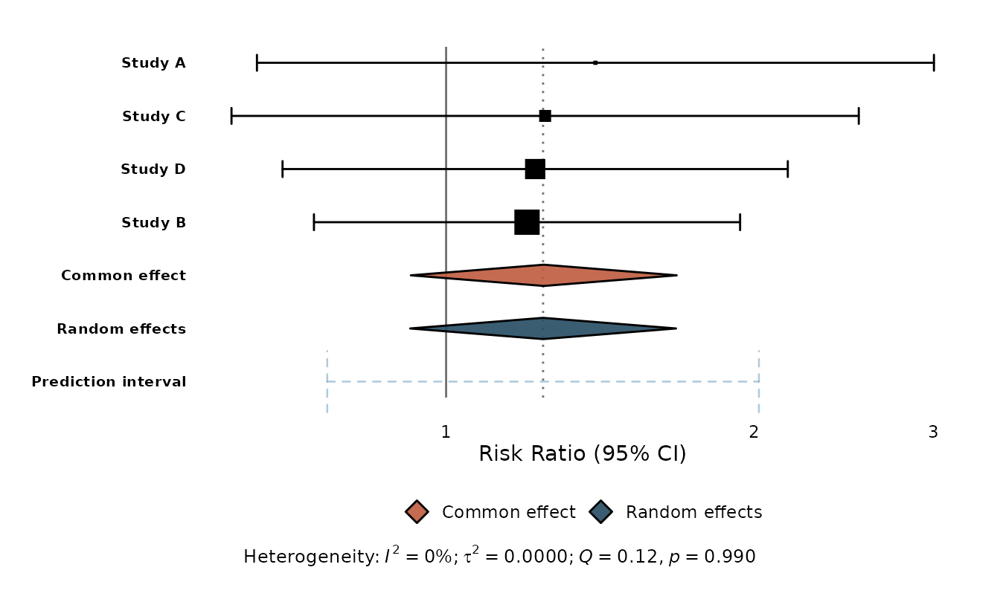
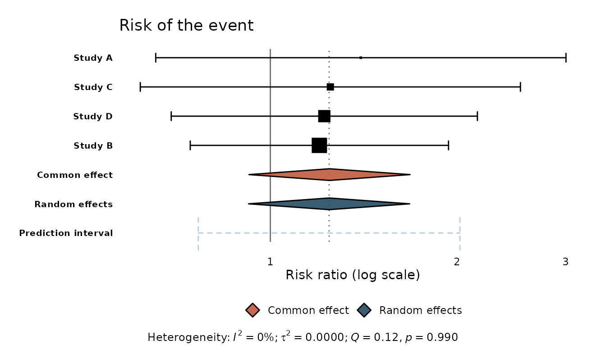
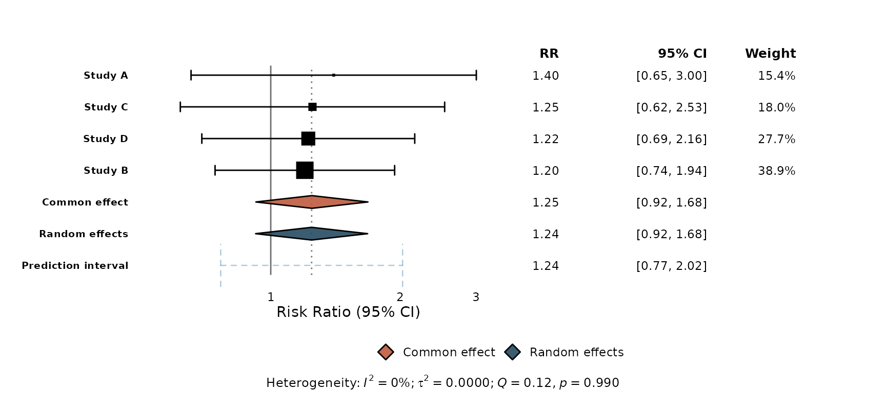
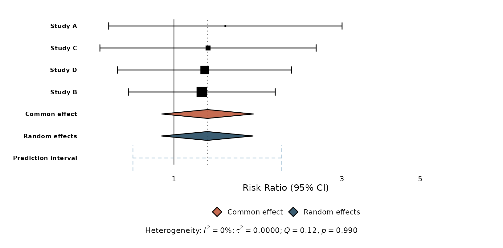

# Coming from meta::forest()

If you already use
[`meta::forest()`](https://wviechtb.github.io/metafor/reference/forest.html),
this vignette shows how `ggmeta` compares and how to reproduce familiar
output.

``` r

library(ggmeta)
library(ggplot2)
```

## The same object, a ggplot result

[`meta::forest()`](https://wviechtb.github.io/metafor/reference/forest.html)
draws directly to a graphics device with a grid-based layout.
[`ggmeta::ggforest()`](https://drhrf.github.io/ggmeta/reference/ggforest.md)
takes the *same* `meta` object but returns a `ggplot`:

``` r

library(meta)
#> Loading required package: metabook
#> Loading 'meta' package (version 8.5-0).
#> Type 'help(meta)' for a brief overview.

m <- metabin(
  event.e = c(14, 30, 15, 22), n.e = c(100, 150, 100, 120),
  event.c = c(10, 25, 12, 18), n.c = c(100, 150, 100, 120),
  studlab = c("Study A", "Study B", "Study C", "Study D"),
  sm = "RR"
)

# meta::forest(m)   # base-graphics forest plot
ggforest(m)         # the same analysis, as a ggplot
```



The practical difference: everything after
[`ggforest()`](https://drhrf.github.io/ggmeta/reference/ggforest.md) is
ggplot2. You compose with `+`, restyle with
[`theme()`](https://ggplot2.tidyverse.org/reference/theme.html), add
annotations, and save with
[`ggsave()`](https://ggplot2.tidyverse.org/reference/ggsave.html).

## What maps to what

| [`meta::forest()`](https://wviechtb.github.io/metafor/reference/forest.html) | `ggmeta` |
|----|----|
| `forest(m)` | `ggforest(m)` |
| `col.square`, `col.diamond`, … | [`theme()`](https://ggplot2.tidyverse.org/reference/theme.html), `scale_*`, layer aesthetics |
| `rightcols` (effect, CI, weight) | `ggforest(columns = TRUE)` |
| custom `leftcols` / `rightcols` | [`geom_forest_text()`](https://drhrf.github.io/ggmeta/reference/geom_forest_text.md) + [`format_effect()`](https://drhrf.github.io/ggmeta/reference/format_effect.md) |
| `xlim`, `xlab`, `smlab` | [`xlim()`](https://ggplot2.tidyverse.org/reference/lims.html), [`labs()`](https://ggplot2.tidyverse.org/reference/labs.html), or the `xlab` argument |
| `layout = "JAMA"` / `"RevMan5"` | [`layout_jama()`](https://drhrf.github.io/ggmeta/reference/layout_jama.md), [`layout_bmj()`](https://drhrf.github.io/ggmeta/reference/layout_bmj.md), [`layout_revman5()`](https://drhrf.github.io/ggmeta/reference/layout_revman5.md) |
| `prediction = TRUE` | drawn automatically when available |
| Study weights (square size) | weight-proportional squares by default |

## Reproducing common tweaks

**Relabel the axis and add a title.** These are ordinary ggplot2 calls:

``` r

ggforest(m) +
  labs(title = "Risk of the event", x = "Risk ratio (log scale)")
```



**Add the effect / CI / weight columns** — the `rightcols` idea — with
`columns`:

``` r

ggforest(m, columns = TRUE)
```



For a *custom* column (say a sample-size column of your own), reach for
[`geom_forest_text()`](https://drhrf.github.io/ggmeta/reference/geom_forest_text.md).
[`tidy_meta()`](https://drhrf.github.io/ggmeta/reference/tidy_meta.md)
exposes the same tidy data frame
[`ggforest()`](https://drhrf.github.io/ggmeta/reference/ggforest.md)
builds internally, so you can align your own text to the rows:

``` r

td <- tidy_meta(m)
studies <- td[!td$is_summary, ]
studies$effect_txt <- format_effect(studies$estimate, studies$ci_lower, studies$ci_upper)

ggforest(m) +
  geom_forest_text(aes(y = studlab, label = effect_txt), data = studies,
                   x = 4.2, hjust = 0) +
  expand_limits(x = 7)
```



## When to use which

- Reach for
  **[`meta::forest()`](https://wviechtb.github.io/metafor/reference/forest.html)**
  when you want its exhaustive, print-ready defaults out of the box and
  don’t need to restyle.
- Reach for **`ggmeta`** when you want a ggplot you can theme, compose,
  facet, and drop into an existing ggplot2 workflow — or when you only
  have a tidy data frame of effect sizes and no `meta` object at all
  (see
  [`vignette("getting-started")`](https://drhrf.github.io/ggmeta/articles/getting-started.md)).
