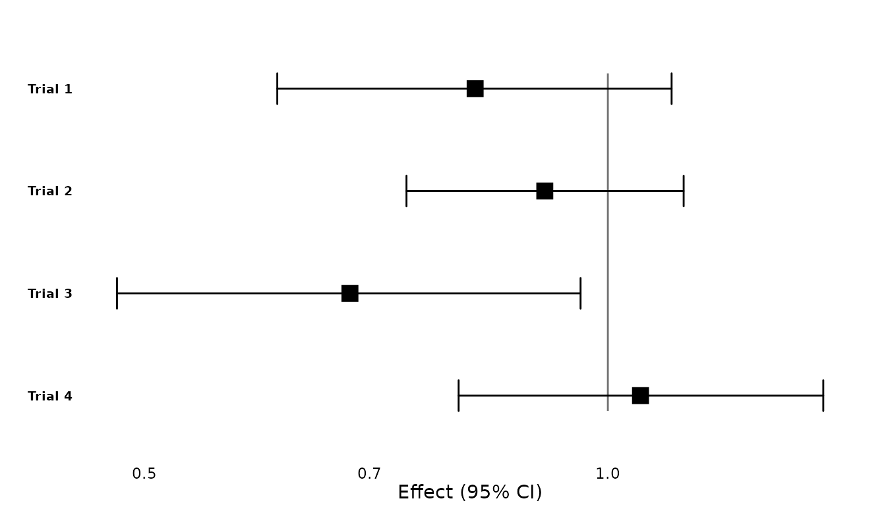
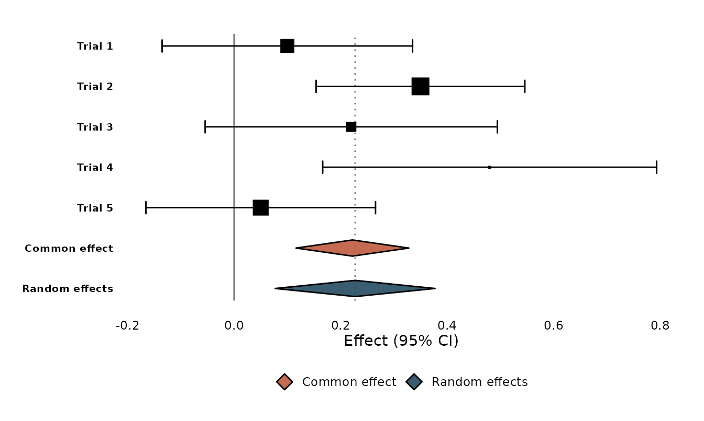
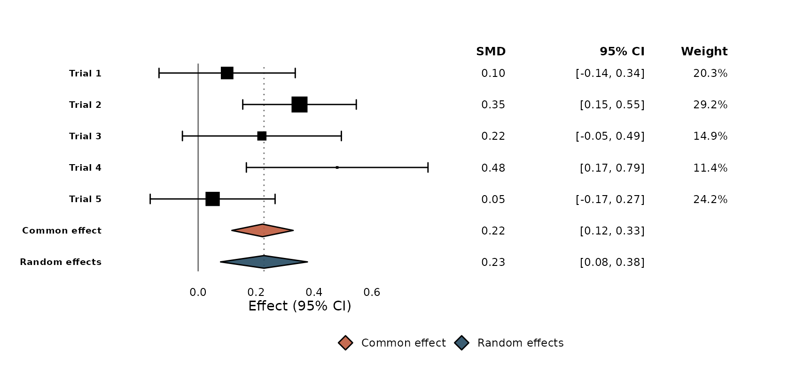
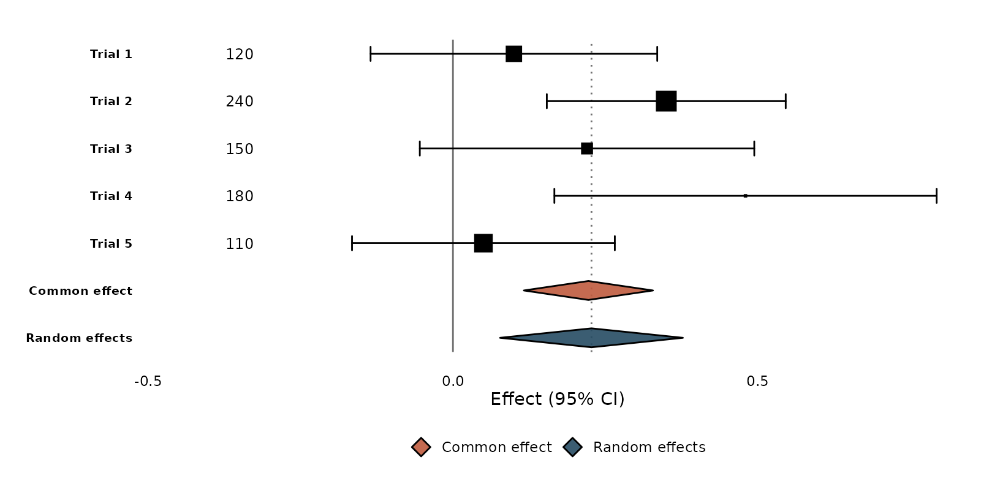
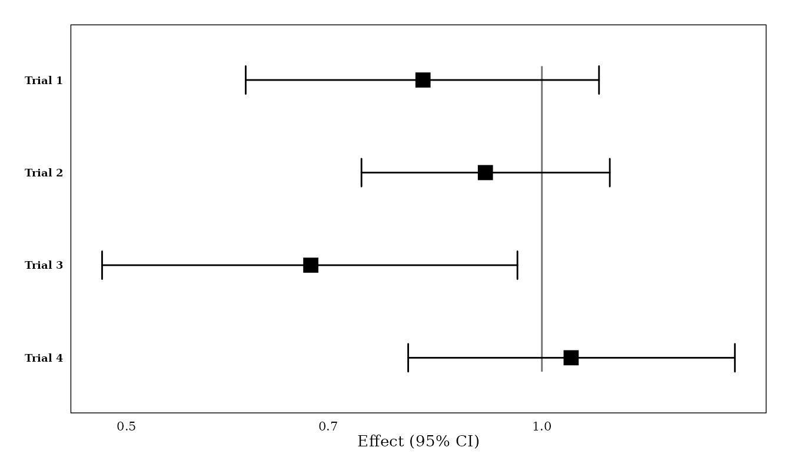
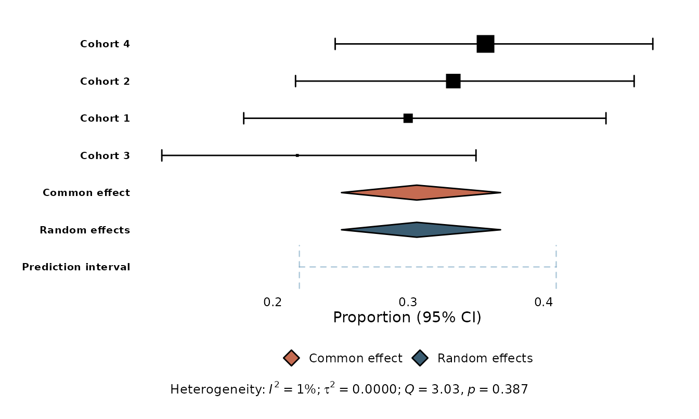

# Getting started with ggmeta

**ggmeta** turns a meta-analysis into a publication-quality forest plot
built on [ggplot2](https://ggplot2.tidyverse.org). It works two ways:

- on a `meta` object (from the
  [meta](https://cran.r-project.org/package=meta) package), or
- on a plain tidy data frame — no `meta` package required.

Because the result is an ordinary `ggplot`, you keep the full ggplot2
toolbox: themes, scales, annotations, and saving with
[`ggsave()`](https://ggplot2.tidyverse.org/reference/ggsave.html).

``` r

library(ggmeta)
library(ggplot2)
```

## A forest plot from a `meta` object

Fit a meta-analysis as usual, then hand it to
[`ggforest()`](https://drhrf.github.io/ggmeta/reference/ggforest.md):

``` r

library(meta)
#> Loading required package: metabook
#> Loading 'meta' package (version 8.5-0).
#> Type 'help(meta)' for a brief overview.

m <- metabin(
  event.e = c(14, 30, 15, 22), n.e = c(100, 150, 100, 120),
  event.c = c(10, 25, 12, 18), n.c = c(100, 150, 100, 120),
  studlab = c("Study A", "Study B", "Study C", "Study D"),
  sm = "RR"
)

ggforest(m)
```


[`ggforest()`](https://drhrf.github.io/ggmeta/reference/ggforest.md)
does the sensible thing automatically: it draws study confidence
intervals with weight-proportional squares, the common- and
random-effects summary diamonds, a prediction interval, a null-effect
reference line, a log x-axis for ratio measures, and a heterogeneity
caption.

## Standalone: a tidy data frame

You don’t need the `meta` package. Any data frame with `studlab`,
`estimate`, `ci_lower`, and `ci_upper` works:

``` r

df <- data.frame(
  studlab  = c("Trial 1", "Trial 2", "Trial 3", "Trial 4"),
  estimate = c(0.82, 0.91, 0.68, 1.05),
  ci_lower = c(0.61, 0.74, 0.48, 0.80),
  ci_upper = c(1.10, 1.12, 0.96, 1.38)
)

ggforest(df, null_effect = 1)
```



### On-the-fly meta-analysis

Give
[`ggforest()`](https://drhrf.github.io/ggmeta/reference/ggforest.md) a
`se` column (or let it recover the standard error from the confidence
interval) and set `add_summary = TRUE` to pool the studies with an
inverse-variance common-effect and a DerSimonian–Laird random-effects
model — without the `meta` package:

``` r

studies <- data.frame(
  studlab  = c("Trial 1", "Trial 2", "Trial 3", "Trial 4", "Trial 5"),
  estimate = c(0.10, 0.35, 0.22, 0.48, 0.05),
  se       = c(0.12, 0.10, 0.14, 0.16, 0.11)
)
studies$ci_lower <- studies$estimate - 1.96 * studies$se
studies$ci_upper <- studies$estimate + 1.96 * studies$se

ggforest(studies, add_summary = TRUE)
```



## A `meta::forest()`-style column table

Set `columns = TRUE` to add the familiar effect / 95% CI / weight
columns with headers to the right of the plot (use `effect_header` to
name the estimate column, and pass a subset like
`columns = c("estimate", "ci")` if you prefer):

``` r

ggforest(studies, add_summary = TRUE, columns = TRUE, effect_header = "SMD")
```



## Custom text columns

For a column of your own — sample sizes, events, anything — use
[`geom_forest_text()`](https://drhrf.github.io/ggmeta/reference/geom_forest_text.md),
which aligns to the study rows through the shared `y`.
[`format_effect()`](https://drhrf.github.io/ggmeta/reference/format_effect.md)
builds an “estimate (CI)” label. Widen the panel with
[`expand_limits()`](https://ggplot2.tidyverse.org/reference/expand_limits.html)
to make room:

``` r

studies$n <- c(120, 240, 150, 180, 110)

ggforest(studies, add_summary = TRUE) +
  geom_forest_text(aes(y = studlab, label = n), data = studies,
                   x = -0.35, hjust = 0.5) +
  expand_limits(x = -0.45)
```



## Journal styles

Layout presets adapt a plot to common journal conventions. They are
ordinary ggplot2 components, so you add them with `+`:

``` r

p <- ggforest(df, null_effect = 1)
layout_jama(p)
```



[`layout_bmj()`](https://drhrf.github.io/ggmeta/reference/layout_bmj.md)
and
[`layout_revman5()`](https://drhrf.github.io/ggmeta/reference/layout_revman5.md)
are also available, and because the plot is a `ggplot` you can keep
customising with
[`theme()`](https://ggplot2.tidyverse.org/reference/theme.html),
[`labs()`](https://ggplot2.tidyverse.org/reference/labs.html), and
friends.

## Other effect measures

[`ggforest()`](https://drhrf.github.io/ggmeta/reference/ggforest.md)
back-transforms every summary measure correctly — exponentiation for
ratios, inverse-logit for logit proportions, Fisher’s *z* for
correlations, and so on. Single-group proportions and rates get no
(meaningless) reference line:

``` r

prop <- metaprop(
  event = c(15, 20, 12, 25), n = c(50, 60, 55, 70),
  studlab = paste("Cohort", 1:4), sm = "PLOGIT"
)
ggforest(prop)
```



## Saving

[`ggforest()`](https://drhrf.github.io/ggmeta/reference/ggforest.md)
returns a `ggplot`, so save it like any other:

``` r

p <- ggforest(df, null_effect = 1)
ggsave("forest.png", p, width = 7, height = 4, dpi = 300)
```

## Where to next

See
[`vignette("from-meta-forest")`](https://drhrf.github.io/ggmeta/articles/from-meta-forest.md)
for a side-by-side comparison with
[`meta::forest()`](https://wviechtb.github.io/metafor/reference/forest.html)
and tips on reproducing its output.
