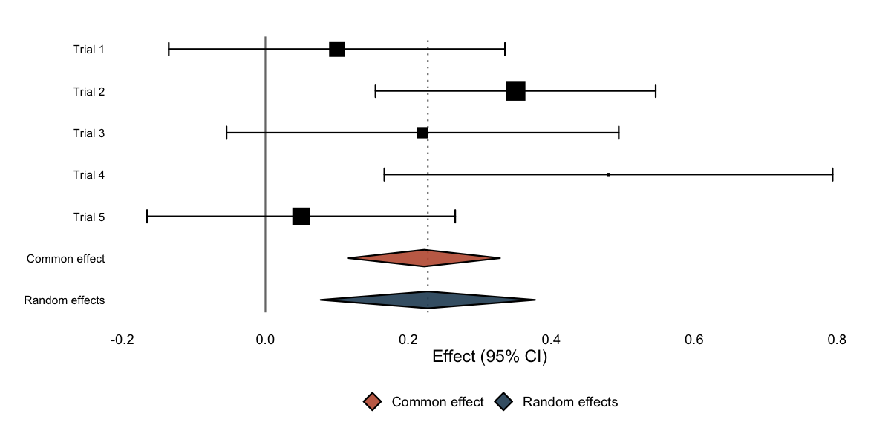

# ggmeta

**ggmeta** builds publication-quality forest plots with
[ggplot2](https://ggplot2.tidyverse.org). Give it a `meta` object (from
the [meta](https://cran.r-project.org/package=meta) package) or a plain
tidy data frame — the result is an ordinary `ggplot` you can theme,
compose, and save.

## Installation

``` r

# install.packages("remotes")
remotes::install_github("drhrf/ggmeta")
```

## Quick start

No `meta` package required — a tidy data frame of effect sizes and
standard errors is enough. Set `add_summary = TRUE` to pool the studies
on the fly (inverse-variance common effect and DerSimonian–Laird random
effects):

``` r

library(ggmeta)

studies <- data.frame(
  studlab  = c("Trial 1", "Trial 2", "Trial 3", "Trial 4", "Trial 5"),
  estimate = c(0.10, 0.35, 0.22, 0.48, 0.05),
  se       = c(0.12, 0.10, 0.14, 0.16, 0.11)
)
studies$ci_lower <- studies$estimate - 1.96 * studies$se
studies$ci_upper <- studies$estimate + 1.96 * studies$se

ggforest(studies, add_summary = TRUE)
```



With a `meta` object,
[`ggforest()`](https://drhrf.github.io/ggmeta/reference/ggforest.md)
reads everything it needs directly:

``` r

library(meta)
m <- metabin(event.e, n.e, event.c, n.c, data = dat, studlab = study, sm = "RR")
ggforest(m)
```

## Why ggmeta?

- **ggplot2 native** — add themes, layers, annotations, and facets; save
  with `ggsave()`.
- **Custom geometries** — proper `ggproto` geoms for CIs, summary
  diamonds, prediction intervals, and reference lines.
- **Correct by construction** — every summary measure is
  back-transformed with its right inverse (ratios, logit proportions,
  Fisher-*z* correlations, rates).
- **Standalone or `meta`** — works on a tidy data frame or a `meta`
  object, and can pool studies itself.
- **Table columns** — add
  [`meta::forest()`](https://wviechtb.github.io/metafor/reference/forest.html)-style
  effect / CI / weight columns with `ggforest(columns = TRUE)`, or
  custom columns with
  [`geom_forest_text()`](https://drhrf.github.io/ggmeta/reference/geom_forest_text.md).
- **Journal styles** —
  [`layout_jama()`](https://drhrf.github.io/ggmeta/reference/layout_jama.md),
  [`layout_bmj()`](https://drhrf.github.io/ggmeta/reference/layout_bmj.md),
  [`layout_revman5()`](https://drhrf.github.io/ggmeta/reference/layout_revman5.md).

## Learn more

- [`vignette("getting-started")`](https://drhrf.github.io/ggmeta/articles/getting-started.md)
  — a tour of the package.
- [`vignette("from-meta-forest")`](https://drhrf.github.io/ggmeta/articles/from-meta-forest.md)
  — coming from
  [`meta::forest()`](https://wviechtb.github.io/metafor/reference/forest.html).
